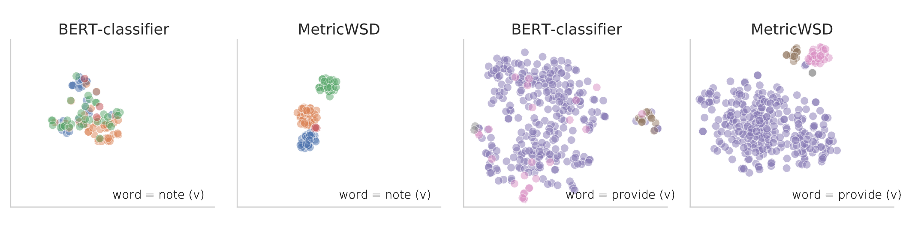

# MetricWSD
Implementation of the paper: [Non-Parametric Few-Shot Learning for Word Sense Disambiguation](https://arxiv.org/abs/2104.12677).



## Dependencies
We use the following training framework and versions. Note that the newer versions of the PyTorch Lightning training framework have compatibility breaking changes. Please make sure to use the version below.

```
torch==1.6.0
pytorch-lightning==0.9.0
transformers==3.3.1
wandb==0.10.4
```

You can directly install through

```
pip install -r requirements.txt
```

## Dataset
We use the [WSD Evaluation Framework](http://lcl.uniroma1.it/wsdeval/) to train and evaluate our models. Note that the `Scorer.java` in the WSD Framework needs to be compiled, with the `Scorer.class` file in the original directory (`Evaluation_Datasets`) of the Scorer file.

## Specifying Paths
Edit the `metric_wsd/config.py` file to specify project level configurations such as the root directory path of the repo (`ROOT_DIR`) and the data directories.

## Run Training
To train, go to the root of the repo and run:

```
python -m metric_wsd.run \
    --run-name <your_run_name> \
    --mode train \
    --model-type cbert-proto \
    --gpus 1 \
    --episodic \
    --batch_size 5 \
    --max_epochs 200 \
    --lr 1e-5 \
    --dist dot \
    --ks_support_kq_query 5 50 5 \
    --sample-strategy-threshold 0 \
    --max_inference_supports 30 \
    --max_queries 20
```

## Run Evaluation
To run evaluation on `SE07` or `ALL`, go the the root of the repo and run:

```
python -m metric_wsd.run_eval \
    --dir $MODEL_DIR_NAME \
    --name $MODEL_CKPT_NAME \
    --max_inference_supports 30 \
    --evalsplit ALL
```
The model directory (`MODEL_DIR_NAME`) should be placed under `metric_wsd/experiments/`.

## Checkpoint
The provided checkpoint folder `MetricWSD` contains the best model `best.ckpt` alongside with the arguments used and the prediction files. Set `MODEL_DIR_NAME=MetricWSD` and `MODEL_CKPT_NAME=best.ckpt` in the evaluation script to rerun evaluation.

## Citation
```
@inproceedings{chen2021metricwsd,
   title={Non-Parametric Few-Shot Learning for Word Sense Disambiguation},
   author={Chen, Howard and Xia, Mengzhou and Chen, Danqi},
   booktitle={North American Association for Computational Linguistics (NAACL)},
   year={2021}
}
```
